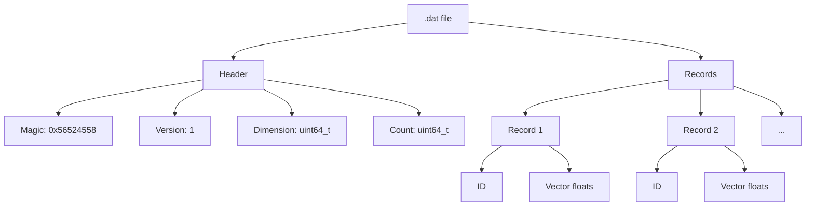

# VectoRex

A from-scratch, high-performance vector similarity search engine in C++ to understand the wokring of the vectordb and systems.

## `.dat` file Architecture

```mermaid
flowchart TD
    A[".dat file"] --> B["Header"]
    B --> C["Magic: 0x56524558"]
    B --> D["Version: 1"]
    B --> E["Dimension: uint64_t"]
    B --> F["Count: uint64_t"]

    A --> G["Records"]

    G --> H["Record 1"]
    H --> I["ID"]
    H --> J["Vector floats"]

    G --> K["Record 2"]
    K --> L["ID"]
    K --> M["Vector floats"]

    G --> N["..."]
```
